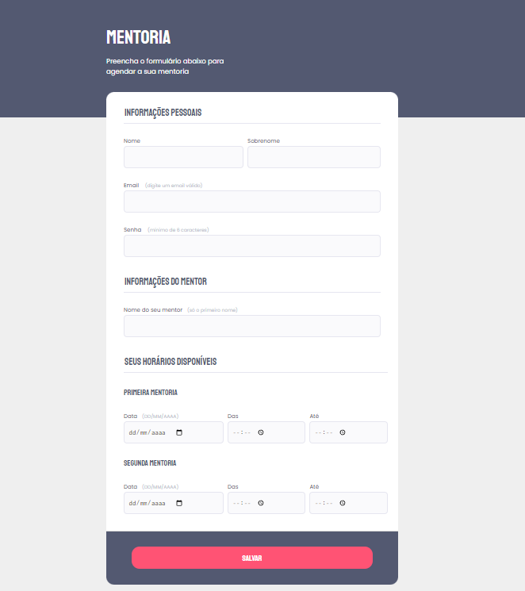

<h1 align="center"> Formulário Stage 3 | Explorer </h1>

  Projeto simples de formulário desenvolvido para estudos em HTML e CSS.

  <a href="#-tecnologias">Tecnologias</a>&nbsp;&nbsp;&nbsp;|&nbsp;&nbsp;&nbsp;
  <a href="#-projeto">Projeto</a>&nbsp;&nbsp;&nbsp;|&nbsp;&nbsp;&nbsp;
  <a href="#-layout">Layout</a>&nbsp;&nbsp;&nbsp;|&nbsp;&nbsp;&nbsp;
  <a href="#memo-licença">Licença</a> 

  

 

  

## 🚀 Tecnologias

Esse projeto foi desenvolvido com as seguintes tecnologias:

- HTML
- CSS

## 💻 Projeto

O projeto consiste em um formulário básico, ideal para iniciantes que estão estudando HTML e CSS. É uma ótima oportunidade para praticar a estruturação de formulários web.

- [Acesse o formulário online](#) <!-- Adicione o link do formulário quando estiver disponível -->

Feito by GuedesCSS :wave:
